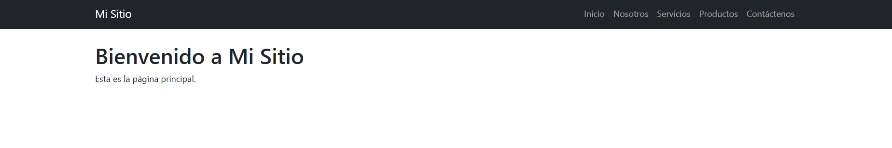
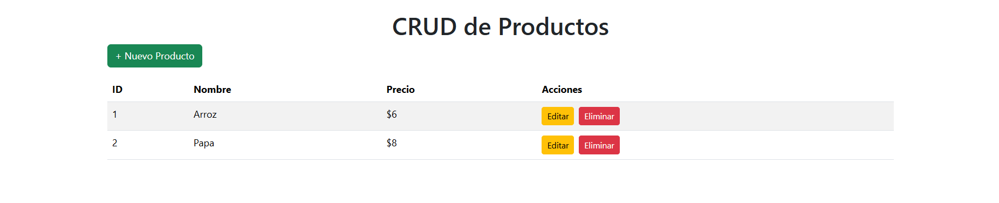
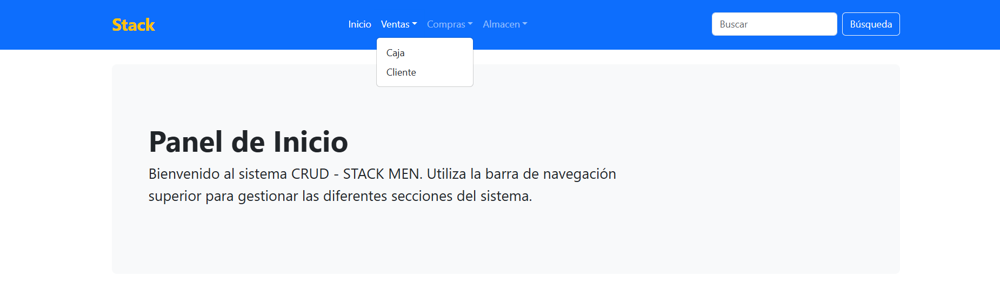
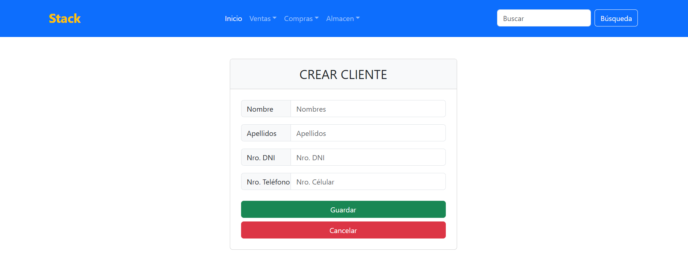
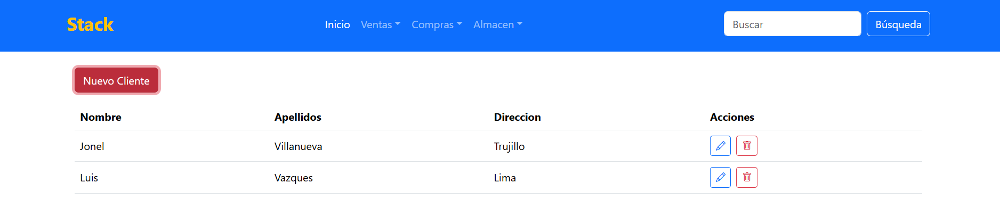

# Ejercicios Resueltos - Node.js & Pug 

Este repositorio contiene los laboratorios prácticos desarrollados con **Node.js** y el motor de plantillas **Pug**. El proyecto está estructurado por ramas independientes para cada ejercicio.

---

## Requisitos e Instalación

Para ejecutar cualquiera de los ejercicios, primero clona el repositorio e instala todas las dependencias necesarias:

```bash
# 1. Clonar el repositorio
git clone https://github.com/Jonel211/lista-clientes-pug.git

# 2. Entrar al directorio del proyecto
cd lista-clientes-pug

# 3. Instalar las dependencias de Node.js
npm install
```

---

## Guía de Ejecución por Ejercicios

Para probar cada solución, debes cambiarte a su respectiva rama ejecutando los comandos indicados en tu terminal:

### Ejercicio 1: Vista Inicial
Pasos para ejecutar la base inicial del motor de plantillas:
```bash
git checkout vista-inicial
node app.js
```
Acceder a: [http://localhost:3000/](http://localhost:3000/)

#### Vista previa del Ejercicio 1


---

### Ejercicio 2: CRUD de Productos
Pasos para ejecutar la sección de administración de productos:
```bash
git checkout crud-productos
node app2.js
```
Acceder a: [http://localhost:3000/](http://localhost:3000/)

#### Vista previa del Ejercicio 2


---

### Ejercicio de Aplicación: Lista de Clientes
Pasos para ejecutar la aplicación:
```bash
git checkout main
node app3.js
```
Acceder a: [http://localhost:3000/](http://localhost:3000/)

#### Vista previa del Ejercicio de Aplicación


---

### Ejercicio de Aplicación 2: Lista de Clientes utilizando el ODM Mongoose
Pasos para ejecutar la aplicación integrada con Mongoose:
```bash
git checkout connection-mongo
copy .env.example .env 

- configura el archivo .env con tus credenciales de MongoDB

node server.js
```
Acceder a: [http://localhost:5000/](http://localhost:5000/) o [http://localhost:3000/](http://localhost:3000/) dependiendo de la configuración del puerto en tu archivo `.env`.

#### Vista previa del Ejercicio de Aplicación 2


---

### Ejercicio de Aplicación 3: Lista de Clientes utilizando el mysql2 y el ORM Sequelize
Pasos para ejecutar la aplicación integrada con Sequelize:
1. **Cambiar a la rama correspondiente**:
   ```bash
   git checkout sql-sequelize-cli
   ```

2. **Base de Datos**:
   * Abre XAMPP (phpMyAdmin o consola) y crea una base de datos vacía llamada `db_clientes`.
   * *(Opcional)* Si tu MySQL tiene contraseña, edita el archivo `config/config.json` para agregarla en `"password": ""`.

3. **Migraciones (Crear tablas)**:
   Ejecuta el siguiente comando para que Sequelize genere automáticamente la tabla de clientes en tu base de datos:
   ```bash
   npx sequelize-cli db:migrate
   ```

4. **Levantar el Servidor**:
   ```bash
   node server2.js
   ```

Acceder a: [http://localhost:3000/](http://localhost:3000/)

#### Vista previa del Ejercicio de Aplicación 3
